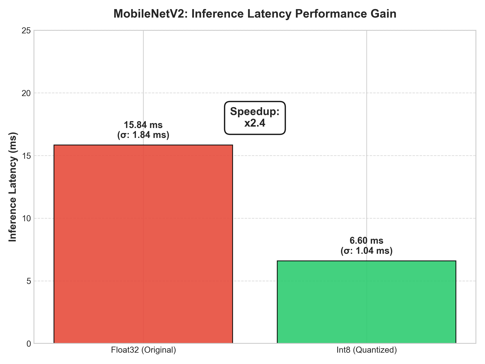
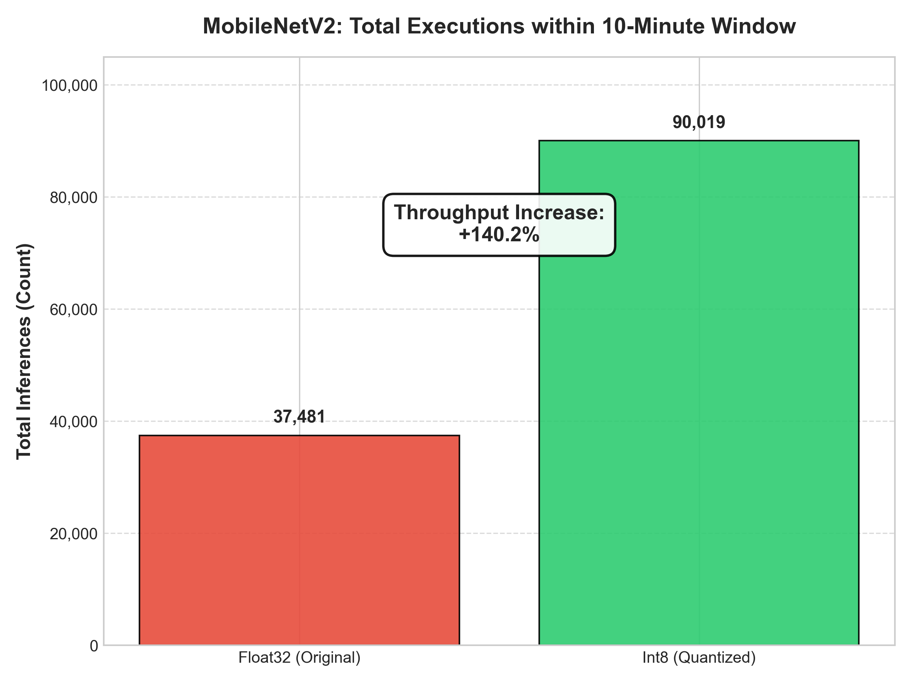
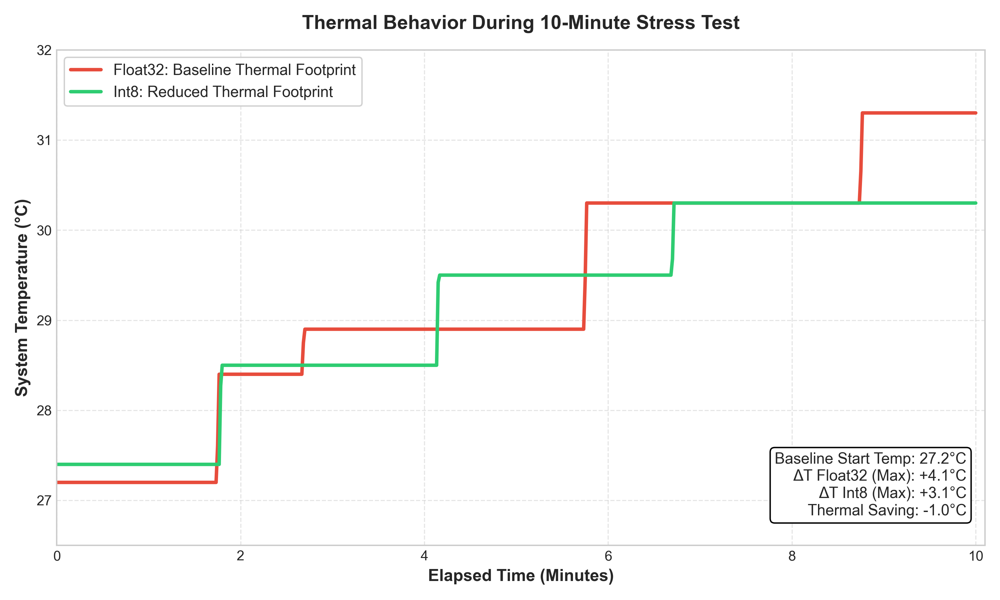

# Edge AI Benchmarking: Float32 vs. Int8 Quantization
Author: Niklas Ebner

This repository contains the complete benchmarking pipeline to evaluate a MobileNetV2 model on mobile edge devices (**Xiaomi 14T Pro** / MediaTek Dimensity 9300+). It directly contrasts native Float32 performance against a post-training quantized Int8 version across latency, throughput, and thermal impact during a continuous 10-minute stress test under Android 14 (HyperOS).

---

## 📂 Project Structure

```text
Post_Training_Quantization_Benchmark/
│
├── android_app/                  # Native Android Studio project (Kotlin)
│   └── app/src/main/java/...     # Inference loop logic (MainActivity.kt)
│
└── ml_pipeline/                  # Python environment for ML tasks & evaluation
    ├── .venv/                    # Virtual environment
    ├── generate_models.py        # Script for model conversion & quantization (PTQ)
    ├── mobilenet_v2_f32.tflite   # Generated Float32 baseline model
    ├── mobilenet_v2_int8.tflite  # Post-training quantized Int8 model
    └── results/                  # Evaluation artifacts and raw data
        ├── benchmark_float32.csv # 10-minute Float32 log
        ├── benchmark_int8.csv    # 10-minute Int8 log
        ├── comparison_diagrams.py# Final plotting script
        ├── final_latency_comparison.png
        ├── final_throughput_comparison.png
        └── final_temperature_trend.png
```
## Key Implementation Details
Thermal Proxy Architecture: Android 14 SELinux policies restrict access to kernel-level CPU temperatures (/sys/class/thermal/) for non-root apps. This project utilizes the official BatteryManager API as a macroscopic system thermal proxy. Its close physical proximity to the SoC ensures accurate tracking of thermal saturation under sustained workloads.

In-Memory Logging: To eliminate hardware disk write overhead (Disk I/O) during the active inference loop, all metrics are cached in RAM (MutableList). Data is dumped to device storage in a single batch operation upon benchmark completion to prevent latency distortion.

Scoped Storage Compliance: Logs are saved directly to context.getExternalFilesDir(null), allowing seamless extraction via ADB without requiring manual runtime storage permissions.

## Setup

### 1. Environment Setup
Navigate to the pipeline directory and install the required dependencies:
```
cd ml_pipeline
.\.venv\Scripts\Activate.ps1
pip install -f requirements.txt
```

### 2. Running the Benchmarks
Open android_app in Android Studio and deploy it to the connected smartphone.

Execute the Int8 and Float32 benchmarks for jeweils exakt 10 Minuten.

Note: Allow the device to cool down completely to room temperature between runs to maintain a consistent baseline.

### 3. Extracting the Dataset via ADB
Pull the finalized log files from the device storage straight into your local results directory:


#### Extract Int8 Logs
```
& "C:\Users\nikla\AppData\Local\Android\Sdk\platform-tools\adb.exe" pull /storage/emulated/0/Android/data/com.example.myapplication/files/benchmark_int8.csv .\results\
```

#### Extract Float32 Logs
```
& "C:\Users\nikla\AppData\Local\Android\Sdk\platform-tools\adb.exe" pull /storage/emulated/0/Android/data/com.example.myapplication/files/benchmark_float32.csv .\results\
```
### 4. Generating the Visualization Plots
Run the evaluation script from within the results folder to generate the figures for the paper:

```
cd results
..\.venv\Scripts\python.exe comparison_diagrams.py
```

## Results:

### 1. Inference Latency Comparison
Contrasts mean inference execution times and variance ($\sigma$), highlighting the performance speedup (~x2.4 gain for Int8).



### 2. Throughput Comparison
A quantitative breakdown of the total processed inferences within the fixed 10-minute testing window (+140.2% throughput increase).



### 3. Thermal Footprint & Delta
Maps the battery temperature curves over time, featuring an info box with the total thermal savings ($\Delta T$).

